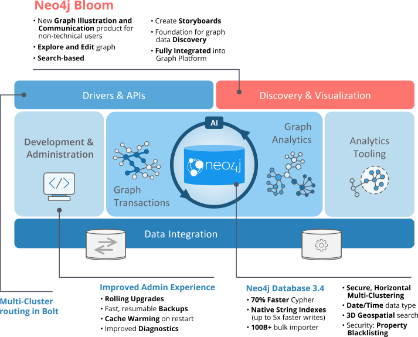

# README - neo4j

https://neo4j.com/

https://neo4j.com/developer/get-started/

https://neo4j.com/docs/driver-manual/1.7/

https://github.com/neo4j-drivers/boltkit

# Bolt V.3

Starting with Neo4j 3.0 a binary protocol called Bolt is supported.

It is based on the PackStream serialization.

+ Cypher Types
+ Protocol Versioning
+ Authentication
+ TLS via certificates
+ Smart client routing for clusters.
+ Load balancing and failover for clusters.

## Bolt Types

| Bolt | Python 3 | Java | JavaScript | C# |
| ---- | -------- | ---- | ---------- | -- |
| null | None | null | null | null |
| List | list | List<Object> | Array | IList<object> |
| Map  | dict | Map<String, Object> | Object | IDictionary<string, object> |
| Boolean | bool | boolean | Boolean | bool |
| Integer | int | long | Integer | long |
| Float | float | double | Number | double |
| String (UTF-8) | str | String | String | string |
| ByteArray | bytearray | byte[] | Int8Array | byte[] |

| Bolt | Python 3 | Java | JavaScript | C# |
| ---- | -------- | ---- | ---------- | -- |
| Date | neotime.Date | LocalDate | Date | LocalDate |
| Time | neotime.Time | OffsetTime | Time | OffsetTime |
| LocalTime | neotime.Time | LocalTime | LocalTime | LocalTime |
| DateTime | neotime.DateTime | ZonedDateTime | DateTime | ZonedDateTime |
| LocalDateTime | neotime.DateTime | LocalDateTime | LocalDateTime | LocalDateTime |
| Duration | neotime.Duration | IsoDuration | Duration | Duration |
  
| Bolt | Python 3 | Java | JavaScript | C# |
| ---- | -------- | ---- | ---------- | -- |
| Point | Point | Point | Point | Point |
| Node | Node | Node | Node | INode |
| Relationship | Relationship | Relationship | Relationship | IRelationship |
| Path | Path | Path | Path | IPath |

**Note:** Node, Relationship and Path can only be found in query results.

JavaScript has no native integer type so a custom Integer type is provided. For convenience, this can be disabled through configuration so that the native Number type is used instead. Note that this can lead to a loss of precision.

C# DateTime zone names adhere to the https://www.iana.org/time-zones

# Neo4j Drivers

https://neo4j.com/developer/language-guides/

https://neo4j.com/docs/driver-manual/current/

| Language    | Git | API  | Changelog |
|-------------|---|---|---|
| Java        | https://github.com/neo4j/neo4j-java-driver | https://neo4j.com/docs/api/java-driver/current/ |   |
| JavaScript  | https://github.com/neo4j/neo4j-javascript-driver | https://neo4j.com/docs/api/javascript-driver/current/ |   |
| Python      | https://github.com/neo4j/neo4j-python-driver | https://neo4j.com/docs/api/python-driver/current/ | https://github.com/neo4j/neo4j-python-driver/wiki |
| .Net        | https://github.com/neo4j/neo4j-dotnet-driver  | https://neo4j.com/docs/api/dotnet-driver/current |   |
| Go          |  https://github.com/neo4j/neo4j-go-driver | https://godoc.org/github.com/neo4j/neo4j-go-driver/neo4j |   |

# Bolt Connectors

Python 1.7.0b1 - Broke out connector code into separate package: neobolt

https://github.com/neo4j-drivers/neobolt

https://github.com/neo4j-drivers/seabolt

https://github.com/neo4j-drivers/gobolt

# Neo4j Server

https://github.com/neo4j/neo4j/wiki/Changelog

https://neo4j.com/developer/docker/

https://github.com/neo4j/neo4j-python-driver/wiki/1.6-changelog - Can now work with Bolt protocol v2, as introduced in server 3.4

https://github.com/neo4j/neo4j-java-driver/wiki/1.0-changelog - A fully new API for Neo4j, and a client implementation of the Bolt V1 protocol.

https://github.com/neo4j/neo4j-dotnet-driver/wiki/1.0-changelog - It provides all the basic features to connect to a 3.0+ Neo4j database and run Cypher statements over the BOLT protocol.

https://github.com/neo4j/neo4j-javascript-driver/wiki/1.0-changelog - A fully new API for Neo4j, and a client implementation of the Bolt V1 protocol.

| Server | Bolt Protocol | Java Driver | JavaScript Driver | Python Driver | .Net Driver | Go Driver |
|---|---|---|---|---|---|---|
| 4.0 | 3.0 | 4.0 | | | | |
| 3.5 | | | | | | |
| 3.4 | 2.0 | | | 1.6 | | |
| 3.3 | | | | | | |
| 3.2 | | | | | | |
| 3.1 | | | | | | |
| 3.0 | 1.0 | | 1.0 | | 1.0 | |
| 2.3 | | | | | | |
| 2.2 | | | | | | |
| 2.1 | | | | | | |
| 2.0 | | | | | | |
| 1.9 | | | | | | |

https://github.com/neo4j/neo4j/wiki/Neo4j-3.2-changelog - Updated Bolt driver to 1.4.3

# Neo4j Ecosystem

https://neo4j.com/docs/

https://neo4j.com/docs/operations-manual/current/

https://neo4j.com/docs/cypher-refcard/current/

https://neo4j.com/docs/cypher-manual/current/

# Graph Visualization

## Java

### JUNG

https://en.wikipedia.org/wiki/JUNG

https://github.com/aamanlamba/jung-neo4j

## JavaScript

### Vis.js

https://visjs.org/

Example with neo4j database: https://github.com/aamanlamba/graphvisjs

http://ciminf.github.io/Hacking-Health-Camp-Hackathon/display-graph.html

### Neovis.js

Based on vis

https://github.com/neo4j-contrib/neovis.js

## Neo4j Bloom

https://neo4j.com/bloom/

**Requirements:** Neo4j Desktop

> Neo4j Desktop is the new mission control center for Developers.
> It’s free with registration, and it includes a free development license for Enterprise Edition allowing you to use Neo4j Enterprise on your local desktop for developing applications.

